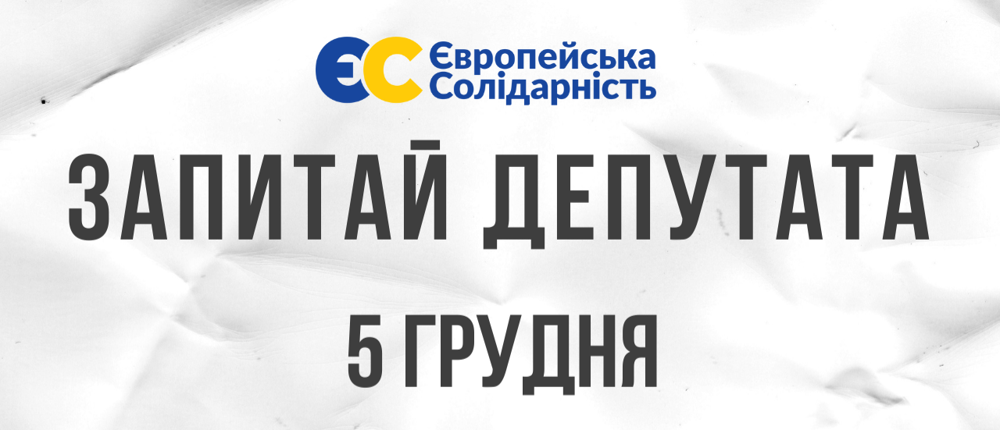

{ width="100%" }

<h4 style='font-weight: normal; margin: 0;' markdown='1'>Маєте запитання до народних обранців? Хочете отримати поради, дізнатися більше про напрямки розвитку свого селища чи містечка, або долучитися до змін у громаді? Запрошуємо Вас завітати на спільний прийом депутатів від [Європейської Солідарності](https://www.facebook.com/ESLviv) на Львівщині, який відбудеться 5 грудня.</h4>

!!! success "Кілька простих кроків до зустрічі з депутатом"
    - [x] Знайдіть округ, за яким обрано депутата, на чий прийом ви хочете потрапити
    - [x] Натисніть на назву округу мишкою (на комп'ютері), або тапніть (на смартфоні)
    - [x] У відображеній таблиці знайдіть рядок з інформацією про депутата
    - [x] Прийдіть на прийом до депутата у зазначене місце та час. **Чекаємо на вас :smiley:!**

!!! note ""
    Для швидшої навігації скористайтеся пошуковим рядком вгорі сторінки, або ж натисніть комбінацію клавіш ++ctrl+f++ (на комп'ютері) і введіть ваш пошуковий запит.

<!-- Зворотній відлік -->
!!! quote ""
    <h2 style='text-align: center; margin: 0; color: #000;'>До початку зустрічей залишилось:</h1>
    <h1 style='text-align: center; margin: 0; color: #000;'><strong id="countdown"></strong></h1>

<!-- /Зворотній відлік -->

<!-- Перелік округів -->

??? quote "Белзька міська рада"
    | П.І.Б. депутата | Місце прийому | Час прийому |
    | - | - | :-: |
    | Прихід Мирослава Олексіївна | м. Белз, вул. 8 березня, 4 | 17:00 |
    | Возьна Марія Василівна | м. Белз, вул. 8 березня, 4 | 17:00 |
    | Кобак Наталія Михайлівна | м. Белз, вул. 8 березня, 4 | 17:00 |
    | Ігнатюк Мирослава Володимирівна | м. Белз, вул. 8 березня, 4 | 17:00 |

??? quote "Бісковицька сільська рада"
    | П.І.Б. депутата | Місце прийому | Час прийому |
    | - | - | :-: |
    | Ваврин Дмитро Васильович | Баранівці, Народний дім | 13:00 |
    | Кохан Володимир Дмитрович | П'яновичі, Центральна, 8 | 13:00 |
    | Дорощак Марія Степанівна | П'яновичі, Центральна, 8 | 13:00 |
    | Віхрак Марія Романівна | Баранівці, Народний дім | 13:00 |
    | Ільчишин Мирослава Василівна | П'яновичі, Центральна, 8 | 13:00 |

??? quote "Боринська селищна рада"
    | П.І.Б. депутата | Місце прийому | Час прийому |
    | - | - | :-: |
    | Маркін Ігор Ілліч | с. Багнувате, приміщення сільської ради | 15:00 |

??? quote "Бориславська міська рада"
    | П.І.Б. депутата | Місце прийому | Час прийому |
    | - | - | :-: |
    | Андросов Андрій Георгійович | м. Борислав, вул. Шевченка, 24 | 16:30 |
    | Чіхрак Василь Миколайович | м. Борислав, вул. Шевченка, 24 | 16:30 |
    | Зелінський Руслан Омельянович | м. Борислав, вул. Шевченка, 24 | 16:30 |
    | Горинь Ірина Іванівна | м. Борислав, вул. Шевченка, 24 | 16:30 |
    | Драган Володимир Іванович | м. Борислав, вул. Шевченка, 24 | 16:30 |
    | Головчак Віталій Степанович | м. Борислав, вул. Шевченка, 24 | 16:30 |
    | Залокоцька Марія Миколаївна | м. Борислав, вул. Шевченка, 24 | 16:30 |
    | Кікіс Роман Ігорович | м. Борислав, вул. Шевченка, 24 | 16:30 |

??? quote "Бродівська міська рада"
    | П.І.Б. депутата | Місце прийому | Час прийому |
    | - | - | :-: |
    | Старик Михайло Іванович | Площа Ринок 1, каб. секретаря ради | 15:00 - 17:00 |
    | Лісковецька Тетяна Степанівна | Площа Ринок 1, каб. секретаря ради | 15:00 - 17:00 |
    | Шишка Руслан Володмирович | Площа Ринок 1, каб. секретаря ради | 15:00 - 17:00 |
    | Тимусь Мирослв Ярославович | Площа Ринок 1, каб. секретаря ради | 15:00 - 17:00 |
    | Кукулка Юрій Ігорович | Площа Ринок 1, каб. секретаря ради | 15:00 - 17:00 |

??? quote "Буська міська рада"
    | П.І.Б. депутата | Місце прийому | Час прийому |
    | - | - | :-: |
    | Лащук Андрій Степанович | м. Буськ, вул. Паркова, 13 | 13:00 |
    | Сай Тетяна Петрівна | м. Буськ, вул. Паркова, 13 | 13:00 |
    | Бабінська Оксана Юріівна | м. Буськ, вул. Паркова, 13 | 13:00 |
    | Дворянин Андрій Степанович | м. Буськ, вул. Паркова, 13 | 13:00 |
    | Майба Ігор Євгенович | м. Буськ, вул. Паркова, 13 | 13:00 |

    [:simple-facebook: Facebook](https://www.facebook.com/%D0%84%D0%B2%D1%80%D0%BE%D0%BF%D0%B5%D0%B9%D1%81%D1%8C%D0%BA%D0%B0-%D0%A1%D0%BE%D0%BB%D1%96%D0%B4%D0%B0%D1%80%D0%BD%D1%96%D1%81%D1%82%D1%8C-%D0%91%D1%83%D1%81%D1%8C%D0%BA-%D0%9A%D1%80%D0%B0%D1%81%D0%BD%D0%B5-101593065911999){ .md-button }

??? quote "Великомостівська Міська рада"
    | П.І.Б. депутата | Місце прийому | Час прийому |
    | - | - | :-: |
    | Пагутяк Ірина Володимирівна | м. Великі Мости, Народний дім, вул. Шевченка, 6 | 13:00 - 14:00 |
    | Булик Галина Ярославівна | с. Бутини, Народний дім | 18:00 - 19:00 |
    | Булик Галина Ярославівна | с. Пристань, Народний дім | 19:00 - 20:00 |
    | Іськевич Руслан Володимирович | с. Боянець, кафе "Ясени" | 17:00 - 18:00 |

??? quote "Глинянська міська рада"
    | П.І.Б. депутата | Місце прийому | Час прийому |
    | - | - | :-: |
    | Буткевич Микола Федорович | м. Глиняни, вул. Шевченка, 38, 2 поверх (приміщення бібліотеки для дорослих) | 11:00 - 13:00 |

??? quote "Городоцька міська рада"
    | П.І.Б. депутата | Місце прийому | Час прийому |
    | - | - | :-: |
    | Сабадаш Максим Євгенійович | м. Львів, вул. Гашека, 2а | 14:00 - 16:00 |
    | Сапуцький Ігор Тадейович | с. Речичани - школа | 11:00 - 14:00 |
    | Кориляк Богдан Богданович | м. Городок, майдан Гайдамаків, 16 | 10:00 - 12:00 |
    | Третяк Ірена Євгенівна | м. Городок, вул. Леся Мартинова, 1 | 11:00 - 15:00 |
    | Дунас Зоряна Ярославівна | м. Городок, вул. Львівська, 17 | 10:00 - 13:00 |
    | Іщук Оксана Володимирівна | м. Городок, вул. Чорновола, 8а | 10:00 - 16:00 |
    | Ніконоров Валерій Миколайович | м. Городок, вул. Перемишлянська, 9а | 14:00 - 16:00 |
    | Сеник Ярослав Іванович | м. Городок, майдан Гайдамаків, 16 | 12:00 - 14:00 |
    | Мєскало Іван Стефанович | м. Городок, майдан Гайдамаків, 16 | 11:00 - 13:00 |
    | Маковецький Віталій Володимирович | с. Дубаневичі - школа | 14:00 - 18:00 |
    | Скомаровський Олег Владиславович | с. Черляни, вул. Польова, 17 | 12:00 - 14:00 |

??? quote "Давидівська сільська рада"
    | П.І.Б. депутата | Місце прийому | Час прийому |
    | - | - | :-: |
    | Данилюк Олег Петрович | с. Давидів, приміщення сільської ради | 10:00 - 11:00 |
    | Гнатів Ірина Леонідівна | с. Давидів, приміщення сільської ради | 13:00 - 14:00 |
    | Читайло Степан Степанович | с. Давидів, приміщення сільської ради | 09:00 - 10:00 |
    | Кухарський Ігор Ярославович | с. Давидів, приміщення сільської ради | 11:00 - 12:00 |
    | Кришталь Світлана Михайлівна | с. Давидів, приміщення сільської ради | 14:00 - 15:00 |
    | Бульба Остап Стефанович | с. Давидів, приміщення сільської ради | 12:00 - 13:00 |

??? quote "Добромильська міська рада"
    | П.І.Б. депутата | Місце прийому | Час прийому |
    | - | - | :-: |
    | Мацько Олена Степанівна | м. Добромиль, площа Ринок, 1 | 16:00 |
    | Сидір Наталія Мирославівна | м. Добромиль, площа Ринок, 1 | 16:00 |
    | Телічак Святослав Зенонович | м. Добромиль, площа Ринок, 1 | 16:00 |

??? quote "Добросинсько-Магерівська сільська рада"
    | П.І.Б. депутата | Місце прийому | Час прийому |
    | - | - | :-: |
    | Клуб Андрій Михайлович | с. Добросин, сільська рада | 13:00 |
    | Говда Любов Петрівна | с. Добросин, сільська рада | 13:00 |

??? quote "Дрогобицька міська рада"
    | П.І.Б. депутата | Місце прийому | Час прийому |
    | - | - | :-: |
    | Задорожній Михайло Леонович | м. Дрогобич, площа Ринок, 6 | 12:00 - 14:00 |
    | Ханас Володимир Йосипович | м. Дрогобич, Механіко-технологічний коледж | 14:00 - 16:00 |
    | Каракевич Орест Юрійович | Дрогобицька міська рада, каб. 201 | 12:00 - 14:00 |
    | Стецик Марія Степанівна | с. Добрівляни, Гімназія | 14:00 - 16:00 |
    | Рупняк Микола Ярославович | Дрогобицька міська рада, каб. 201 | 12:00 - 14:00 |
    | Бейзик Роман Степанович | с. Унятичі, приймальня колишньої сільської ради | 13:00 - 15:00 |
    | Стечкевич Ігор Орестович | м. Стебник, приймальня колишної міської ради | 14:00 - 16:00 |
    | Беднарчик Наталія Миронівна | м. Стебник, приймальня колишньої міської ради | 14:00 - 16:00 |
    | Стебельська Оксана Миколаївна | Дрогобицька міська рада, каб. 201 | 14:00 - 16:00 |

??? quote "Дрогобицька районна рада"
    | П.І.Б. депутата | Місце прийому | Час прийому |
    | - | - | :-: |
    | Шевкенич Андрій Іванович | м. Дрогобич, вул. 22 січня (Районна рада) | 12:00 - 14:00 |
    | Сливич Андрій Ярославович | с. Меденичі, приміщення селищної ради | 12:00 - 14:00 |
    | Левицький Андрій Олегович | м. Борислав, приміщення міської ради | 12:00 - 14:00 |
    | Винарчик Світлана Ярославівна | м. Стебник, приміщення міської ради | 12:00 - 14:00 |
    | Пасемко Василь Васильович | с. Доброгостів, приміщення сільської ради | 12:00 - 14:00 |
    | Скірко Орест Володимирович | с. Рихтичі, приміщення сільської ради | 12:00 - 14:00 |
    | Янів Андрій Євстахійович | м. Дрогобич, площа Ринок, 1 | 12:00 - 14:00 |
    | Головкевич Марія Миколаївна | м. Дрогобич, вул. Шевченка 2 | 12:00 - 14:00 |  |
    | Заяць Ольга Василівна | м. Дрогобич, Ліцей N14, вул. Грушевського, 87 | 12:00 - 14:00 |
    | Николаїшин Марія Іванівна | м. Дрогобич, вул. Шевченка, 2 | 12:00 - 14:00 |
    | Конц Віктор Ярославович | м. Трускавець, приміщення міської ради | 12:00 - 14:00 |

??? quote "Жидачівська міська рада"
    | П.І.Б. депутата | Місце прийому | Час прийому |
    | - | - | :-: |
    | Гаврильчук Ярослав Григорович | м. Жидачів, вул. Шашкевича, 2 | 13:00 |
    | Мажак Зіновій Миколайович | м. Жидачів, вул. Шашкевича, 2 | 13:00 |
    | Романів Богдан Іванович | м. Жидачів, вул. Шашкевича, 2 | 13:00 |
    | Швед Андрій Ярославович | м. Жидачів, вул. Шашкевича, 2 | 13:00 |

??? quote "Жовківська міська рада"
    | П.І.Б. депутата | Місце прийому | Час прийому |
    | - | - | :-: |
    | Щур Надія Степанівна | м. Жовква, вул. Львівська, 40 | 16:00 |
    | Креховець Зіновій Мар'янович | м. Жовква, вул. Львівська, 40 | 16:00 |
    | Звір Руслан Васильович | Воля Висоцька, сільська рада | 16:00 |
    | Діденко Тарас Васильович | м. Жовква, вул. Львівська, 40 | 16:00 |
    | Чурій Ірина Степанівна | м. Жовква, вул. Львівська, 40 | 16:00 |

??? quote "Журавненська селищна рада"
    | П.І.Б. депутата | Місце прийому | Час прийому |
    | - | - | :-: |
    | Артемчук Роман Васильович | с. Журавно, Народний дім | 13:00 |
    | Башта Ярослав Миколайович | с. Журавно, Народний дім | 13:00 |
    | Ковалишин Ірина Євгенівна | с. Журавно, Народний дім | 13:00 |
    | Ніколін Василь Богданович | с. Журавно, Народний дім | 13:00 |

??? quote "Заболотцівська сільська рада"
    | П.І.Б. депутата | Місце прийому | Час прийому |
    | - | - | :-: |
    | Леськів Марія Володимирівна | с. Заболотці, сільська рада | 10:00 - 11:00 |

??? quote "Зимноводівська сільська рада"
    | П.І.Б. депутата | Місце прийому | Час прийому |
    | - | - | :-: |
    | Калька Михайло Михайлович | с. Зимна Вода, приміщення сільської ради | 17:00 |

??? quote "Івано-Франківська селищна рада"
    | П.І.Б. депутата | Місце прийому | Час прийому |
    | - | - | :-: |
    | Крилошанська Оксана Василівна | с. Івано-Франково, площа Ринок, 1 | 17:00 |
    | Чернецький Ростислав Русланович | с. Івано-Франково, площа Ринок, 1 | 17:00 |
    | Бутка Христина Василівна | с. Івано-Франково, площа Ринок, 1 | 17:00 |
    | Кулеба Богдан Романович | с. Івано-Франково, площа Ринок, 1 | 17:00 |

??? quote "Кам’янка-Бузька міська рада"
    | П.І.Б. депутата | Місце прийому | Час прийому |
    | - | - | :-: |
    | Крилошанська Оксана Василівна | с. Івано-Франково, площа Ринок, 1 | 17:00 |
    | Загорняк Ольга Мирославівна | м. Кам'янка-Бузька, вул. Гаватовича, 9 | 14:00 |
    | Грицаль Роман Богданович | м. Кам'янка-Бузька, вул. Гаватовича, 9 | 14:00 |
    | Шайнога Оксана Степанівна | м. Кам'янка-Бузька, вул. Гаватовича, 9 | 14:00 |

??? quote "Красненська селищна рада"
    | П.І.Б. депутата | Місце прийому | Час прийому |
    | - | - | :-: |
    | Дідух Світлана Олегівна | м. Буськ, вул. Паркова, 13 | 13:00 |
    | Нестерович Андрій Васильович | м. Буськ, вул. Паркова, 13 | 13:00 |
    | Миляновський Степан Романович | м. Буськ, вул. Паркова, 13 | 13:00 |

??? quote "Куликівська селищна рада"
    | П.І.Б. депутата | Місце прийому | Час прийому |
    | - | - | :-: |
    | Карфут Назар Сергійович | с. Куликів, Народний дім | 12:00 - 15:00 |
    | Кушпіт Лев Борисович | с. Куликів, Народний дім | 12:00 - 15:00 |
    | Цюпка Ірина Степанівна | с. Куликів, Народний дім | 12:00 - 15:00 |
    | Кубра Олена Богданівна | с. Куликів, Народний дім | 12:00 - 15:00 |

??? quote "Львівська міська рада"
    | П.І.Б. депутата | Місце прийому | Час прийому |
    | - | - | :-: |
    | Маруняк Оксана Іванівна | м. Львів, площа Ринок, 1, каб. 219 | 17:00 - 19:00 |
    | Мелесова-Вальчак Лейла Магомедівна | м. Львів, вул. Шевченка, 78 | 10:00 - 12:45 |
    | Окряк Анастасія Ізидорівна | м. Львів, вул. В.Винниченка, 12, 3 поверх | 12:00 - 14:00 |
    | Грицевич Роман Євгенович | м. Львів, вул. Хімічна, 7, 2 поверх, каб.1 | 17:00 - 19:00 |
    | Дідух Михайло Олексійович | м. Львів, вул. Шевченка, 300а | 17:00 - 19:00 |
    | Лесик Володимир Любомирович | м. Львів, вул. Стороженка, 12 | 17:00 - 19:00 |
    | Пелех Олена Зінонівна | Брюховицька селищна рада, вул. Ясна, 1 | 12:00 - 14:00 |

??? quote "Львівська обласна рада"
    | П.І.Б. депутата | Місце прийому | Час прийому |
    | - | - | :-: |
    | Стефанків Святослав Миколайович | м. Трускавець, вул. Бориславська, 2 | 17:00 - 19:00 |
    | Фенчин Олег Романович | Червоноградська міська рада, кабінет секретаря міської ради | 13:00 - 15:00 |
    | Кирилич Володимир Ігорович | м. Кам'янка-Бузька, вул. Гаватовича, 9 | 14:00 |
    | Баран Василь Степанович | м. Перемишляни, приміщення міської ради, кабінет секретаря ради | 10:00-12:00 |
    | Дума Андрій Романович | смт. Куликів, приміщення народного дому | 12:00 - 15:00 |
    | Доманський Володимир Володимирович | м. Яворів, вул. Святоюрська, 5а | 10:00 - 12:00 |
    | Дуда Олег Романович | Івано-Франково, площа Ринок, 1 | 17:00 |
    | Шеремета Святослав Петрович | м. Львів, вул. Винниченка, 12, 3 поверх | 10:00 |
    | Ярмола Анна Петрівна | Червоноградська міська рада, кабінет секретаря міської ради | 13:00 - 15:00 |

    [:simple-facebook: Facebook](https://www.facebook.com/EuropeanSolidarity.Lviv.Regional.Council){ .md-button }

??? quote "Львівська районна рада"
    | П.І.Б. депутата | Місце прийому | Час прийому |
    | - | - | :-: |
    | Кіянка Ірина Богданівна | смт. Куликів, приміщення народного дому | 14:30 |
    | Кіянка Ірина Богданівна | с. Добросин, приміщення сільської ради | 13:00 |
    | Прокопів Андрій Іванович | м. Львів, вул. Черемшини, 44 | 12:00 - 13:00 |
    | Грабовська Оксана Григорівна | м. Львів, вул. Михальчука, 4 | 11:00 - 13:00 |
    | Драч Галина Олексіївна | м. Львів, площа Ринок, 1, каб. 219 | 14:00 - 16:00 |
    | Зінкевич Ігор Ілліч | м. Львів, вул. Винниченка, 12, 3 поверх |  |
    | Гера Людмила Петрівна | м. Львів, вул. Винниченка, 12, 3 поверх | 16:00 - 17:00 |
    | Лучко Оксана Володимирівна | смт. В.Любінь, вул. Львівська, 173 | 11:00 - 14:00 |
    | Матківський Анатолій Вікторович | м. Городок, майдан Гайдамаків, 16 | 12:00 - 14:00 |
    | Фостяк Оксана Михайлівна | м. Городок, майдан Гайдамаків, 16 | 10:00 - 12:00 |
    | Андрес Олександра Володимирівна | смт. Куликів, приміщення народного дому | 12:00 - 15:00 |

    [:simple-facebook: Facebook](https://www.facebook.com/profile.php?id=100067811160349){ .md-button }

??? quote "Меденицька селищна рада"
    | П.І.Б. депутата | Місце прийому | Час прийому |
    | - | - | :-: |
    | Кішко Любов Миронівна | смт. Меденичі, вул. Незалежності, 52 | 12:00 |
    | Лучків Марія Миколаїнв | смт. Меденичі, вул. Незалежності, 52 | 12:00 |
    | Сьорак Михайло Зіновійович | смт. Меденичі, вул. Незалежності, 52 | 12:00 |
    | Середяк Андрій Петрович | смт. Меденичі, вул. Незалежності, 52 | 12:00 |
    | Данилишин Ігор Іванович | смт. Меденичі, вул. Незалежності, 52 | 12:00 |
    | Зварич Ігор Іванович | смт. Меденичі, вул. Незалежності, 52 | 12:00 |

??? quote "Миколаївська міська рада"
    | П.І.Б. депутата | Місце прийому | Час прийому |
    | - | - | :-: |
    | Оприск Тарас Петрович | м. Миколаїв, вул. Чешека 1 | 13:00 |
    | Бачик Андрій Степановч | м. Миколаїв, вул. Чешека 1 | 13:00 |
    | Верещинська Наталія Володимирівна | м. Миколаїв, вул. Чешека 1 | 13:00 |
    | Оприск Микола Петрович | м. Миколаїв, вул. Чешека 1 | 13:00 |
    | Оприск Микола Володимирович | м. Миколаїв, вул. Чешека 1 | 13:00 |

??? quote "Моршинська міська рада"
    | П.І.Б. депутата | Місце прийому | Час прийому |
    | - | - | :-: |
    | Чернецький Михайло Ярославович | с. Воля-Задеревацька, приміщення сільської ради | 17:00 |
    | Жовнір Валерій Васильович | м. Моршин, вул. І.Франка, 27, 3 поверх | 17:00 |
    | Войтановська Лілія Степанівна | с. Лукавиця, Народний дім | 17:00 |
    | Колодяжна Ольга Іванівна | с. Станків, приміщення сільської ради | 17:00 |
    | Томчук Віра Володимирівна | м. Моршин, вул. І.Франка, 27, 3 поверх | 17:00 |
    | Ільницький Василь Михайлович | м. Моршин, вул. І.Франка, 27, 3 поверх | 17:00 |
    | Бенюх Володимир Романович | с. Станків, приміщення сільської ради | 17:00 |

??? quote "Новороздільська міська рада"
    | П.І.Б. депутата | Місце прийому | Час прийому |
    | - | - | :-: |
    | Волчанський Володимир Миронович | м. Новий розділ, Міська рада, каб. 123 | 16:00 |
    | Царик Оксана Петрівна | м. Новий Розділ, Міська рада, кабінет секретаря ради | 16:00 |
    | Броневич Ігор Михайлович | м. Новий Роздвл, Міська рада,к аб.відділу зв'язків з громадськістю | 16:00 |

??? quote "Перемишлянська міська рада"
    | П.І.Б. депутата | Місце прийому | Час прийому |
    | - | - | :-: |
    | Андрусишин Роман Богданович | м. Перемишляни, міська рада | 10:00 - 12:00 |
    | Кічула Світлана Іванівна | с. Болотні, школа | 10:00 - 12:00 |
    | Вархолик Оксана Іванівна | Дунаїв, присіщення старостинського округу | 10:00 - 12:00 |
    | Козак Богдан Михайлович | с. Вовків, старостинський округ | 10:00 - 12:00 |
    | Заневич Богдан Романович | м. Перемишляни, Інфекційне відділення Перемишлянської лікарні | 10:00 - 12:00 |
    | Сайко Микола Васильович | м. Перемишляни, Територіальний центр | 10:00 - 12:00 |
    | Турчиняк Надія Іванівна | м. Перемишляни, міська рада, кабінет секретаря | 10:00 - 12:00 |

??? quote "Пустомитівська міська рада"
    | П.І.Б. депутата | Місце прийому | Час прийому |
    | - | - | :-: |
    | Паздерська Оксана Володимирівна | м. Пустомити, приміщення міської ради | 17:00 |
    | Салагай Тарас Васильович | м. Пустомити, приміщення міської ради | 17:00 |
    | Лабай Іван Михайлович | м. Пустомити, приміщення міської ради | 17:00 |
    | Кузьмин Петро Михайлович | м. Пустомити, приміщення міської ради | 17:00 |
    | Коваль Андрій Геннадійович | м. Пустомити, приміщення міської ради | 17:00 |
    | Крисько Іван Богданович | м. Пустомити, приміщення міської ради | 17:00 |
    | Саган Іван Миколайович | м. Пустомити, приміщення міської ради | 17:00 |
    | Житницька Наталія Юріївна | м. Пустомити, приміщення міської ради | 17:00 |

??? quote "Рава-Руська міська рада"
    | П.І.Б. депутата | Місце прийому | Час прийому |
    | - | - | :-: |
    | Федюк Володимир Петрвич | с. Гійче, приміщення старостинського округу | 12:00 |
    | Була Ірина Іванівна | м. Рава-Руська, вул. Грушевського, 120 | 12:00 |
    | Петрусь Петро Петрович | с. Волиця, приміщення старостинського округу | 12:00 |
    | Вольський Юрій Григорович | с. Потелич, приміщення старостинського округу | 12:00 |
    | Левочко Степан Федорович | с. Нова Кам'янка, приміщення старостинського округу | 12:00 |
    | Лявтошлягер Владислав Мар'янович | с. Потелич, приміщення старостинського округу | 12:00 |

??? quote "Ралівська сільська рада"
    | П.І.Б. депутата | Місце прийому | Час прийому |
    | - | - | :-: |
    | Саган Михайло Мирославович | c. Кульчиці, вул. Поливки, 194а | 11:00 |
    | Багрій Ірина Вікторівна | с. Ралівка, вул.І.Франка, 28 | 11:00 |
    | Яріш Наталія Романівна | с. Ралівка, вул. І.Франка, 28 | 11:00 |

??? quote "Розвадівська сільська рада"
    | П.І.Б. депутата | Місце прийому | Час прийому |
    | - | - | :-: |
    | Болехан Тетяна Василівна | с. Черниця, приміщення народного дому | 12:00 - 14:00 |

??? quote "Рудківська міська рада"
    | П.І.Б. депутата | Місце прийому | Час прийому |
    | - | - | :-: |
    | Федак Ростислав Євгенович | м. Рудки, приміщення бібліотеки, площа Відродження, 22 | 12:00 - 13:00 |
    | Винницька Світлана Іванівна | м. Рудки, приміщення бібліотеки, площа Відродження, 22 | 13:00 - 14:00 |
    | Качинський Петро Михайлович | м. Рудки, приміщення бібліотеки, площа Відродження, 22 | 14:00 - 15:00 |
    | Стріжик Марія Михайлівна | м. Рудки, приміщення бібліотеки, площа Відродження, 22 | 15:00 - 16:00 |
    | Гусар Ольга Антонівна | м. Рудки, приміщення бібліотеки, площа Відродження, 22 | 16:00 - 17:00 |
    | Процько Василь Васильович | м. Рудки, приміщення бібліотеки, площа Відродження, 22 | 17:00 - 18:00 |
    | Самардак Володимир Володимирович | м. Рудки, приміщення бібліотеки, площа Відродження, 22 | 18:00 - 19:00 |

??? quote "Самбірська міська рада"
    | П.І.Б. депутата | Місце прийому | Час прийому |
    | - | - | :-: |
    | Гайдучок Лілія Іванівна | м. Самбір, вул. Мазепи, 8 | 13:00 |
    | Романяк Іван Миколайович | м. Самбір, вул. Мазепи, 8 | 13:00 |
    | Малецький Ігор Володимирович | м. Самбір, вул. Мазепи, 8 | 13:00 |

??? quote "Сколівська міська рада"
    | П.І.Б. депутата | Місце прийому | Час прийому |
    | - | - | :-: |
    | Юрків Богдан Юрійович | м. Сколе, Майдан Незалежності, 1 | 10:00 |
    | Яремко Оксана Василівна | м. Сколе, Майдан Незалежності, 1 | 10:00 |
    | Комарницький Микола Михайлович | м. Сколе, Майдан Незалежності, 1 | 10:00 |

??? quote "Сокальська міська рада"
    | П.І.Б. депутата | Місце прийому | Час прийому |
    | - | - | :-: |
    | Плечінь Ігор Якович | м. Сокаль, вул. Героїв УПА, 42 | 13:00 |
    | Веклин Михайло Тимофійович | м. Сокаль, вул. Героїв УПА, 42 | 13:00 |
    | Іванчина Олег Антонович | м. Сокаль, вул. Героїв УПА, 42 | 13:00 |

??? quote "Солонківська сільська рада"
    | П.І.Б. депутата | Місце прийому | Час прийому |
    | - | - | :-: |
    | Кечур Оксана Дмитрівна | с. Солонка, вул. Центральна, 1 | 12:00 |
    | Цурак Юрій Васильович | с. Зубра, вул. І.Франка, 6а | 12:00 |
    | Доскіч Юрій Романович | с. Зубра, вул. І.Франка, 6а | 12:00 |
    | Зайльо Марія Ярославівна | с. Солонка, вул. Центральна, 1 | 12:00 |
    | Михальський Олег Михайлович | с. Раковець, вул. Центральна, 61а | 12:00 |
    | Тарнавський Тарас Михайлович | с. Зубра, вул. І.Франка, 6а | 12:00 |
    | Михальчук Олександр Пилипович | с. Вовків, вул. Центральна, 27 | 12:00 |
    | Флерчук Микола Миколайович | с. Поршна, вул. Шевченка, 38 | 12:00 |
    | Ширій-Ярема Ірина Ігорівна | с. Жирівка, вул. Центральна, 28 | 12:00 |
    | Юськевич Іван Ігорович | с. Солонка, вул. Центральна, 61а | 12:00 |

??? quote "Стрийська міська рада"
    | П.І.Б. депутата | Місце прийому | Час прийому |
    | - | - | :-: |
    | Булин Іван Степанович | Кімната депутата Стрийської міської ради | 15:00 - 16:00 |
    | Сафіяник Ігор Миколайович | м. Стрий, вул. Коссака, 11б | 15:00 - 16:00 |
    | Салдан Іванна Миколаївна | Кімната депутата Стрийської міської ради | 15:00 - 16:00 |
    | Равлінко Ігор Ярославович | Кімната депутата Стрийської міської ради | 15:00 - 16:00 |
    | Левицький Тарас Богданович | с. П'ятничани, приміщення колишньої сільської ради | 15:00 - 16:00 |
    | Турчак Любомир Мирославович | Кімната депутата Стрийської міської ради | 15:00 - 16:00 |
    | Берник Мар'ян Володимирович | Кімната депутата Стрийської міської ради | 15:00 - 16:00 |
    | Вишинська Оксана Мирославівна | м. Стрий, вул. І.Франка, 8 | 15:00 - 16:00 |
    | Зварич Оксана Остапівна | м. Стрий, майдан Ринок, 34/1 | 15:00 - 16:00 |
    | Зрайло Іван Іванович | Кімната депутата Стрийської міської ради | 15:00 - 16:00 |

    [:simple-facebook: Facebook](https://www.facebook.com/europeansolidaritystryy/){ .md-button } [:simple-instagram: Instagram](https://www.instagram.com/stryy_europeansolidarity/){ .md-button }

??? quote "Стрийська районна рада"
    | П.І.Б. депутата | Місце прийому | Час прийому |
    | - | - | :-: |
    | Палько Світлана Георгіївна | м. Стрий, вул. Степана Бандери, 28, каб. №26 | 15:00 - 17:00 |
    | Петрівський Іван Миколайович | м. Стрий, вул. Степана Бандери, 28, каб. №26 | 15:00 - 17:00 |
    | Стеців Олег Романович | м. Новий Розділ, вул. Грушевського, 24 | 15:00 - 17:00 |
    | Рогуля Марія Миколаївна | м. Миколаїв, вул. Шептицького, 82 | 15:00 - 17:00 |
    | Костів Василь Георгійович | м. Стрий, вул. Степана Бандери 28, каб. №26 | 15:00 - 17:00 |
    | Меленик Наталія Ярославівна | м. Стрий, вул.Степана Бандери 28, каб. №26 | 15:00 - 17:00 |
    | Сличко Світлана Василівна | м. Сколе, майдан Незалежності, 1 | 10:00 - 12:00 |
    | Ягніщак Ярослав Миронович | смт. Журавно, вул. Степана Бандери, 23 | 13:00 - 15:00 |
    | Савка Богдан Петрович | м. Миколаїв, вул. Шептицького, 82 | 15:00 - 17:00 |

    [:simple-facebook: Facebook](https://www.facebook.com/europeansolidaritystryy/){ .md-button } [:simple-instagram: Instagram](https://www.instagram.com/stryy_europeansolidarity/){ .md-button }

??? quote "Тростянецька сільська рада"
    | П.І.Б. депутата | Місце прийому | Час прийому |
    | - | - | :-: |
    | Соснило Ігор Дмитрович | Приміщення Закладського старостинського округу | 17:00 |
    | Борачок Оксана Богданівна | с. Липівка, Народний дім | 17:00 |
    | Бабій Володимир Євгенович | с. Стільсько, Народний дім  | 17:00 |
    | Возний Роман Володимирович | Приміщення Демнянського старостинського округу | 17:00 |
    | Карлицька Мар'яна Володимирівна | Приміщення Демнянського старостинського округу | 17:00 |
    | Ярошельський Андрій Миколайович | с. Тростянець, Народний дім | 17:00 |

??? quote "Трускавецька міська рада"
    | П.І.Б. депутата | Місце прийому | Час прийому |
    | - | - | :-: |
    | Кульчинський Андрій Богданович (міський голова) | м. Трускавець, вул. Бориславська, 2 | 17:00 - 19:00 |
    | Стародуб Анатолій Георгійович | м. Трускавець, вул. Бориславська, 2 | 17:00 - 19:00 |
    | Галик Михайло Нестерович | м. Трускавець, вул. Бориславська, 2 | 17:00 - 19:00 |
    | Стасик Ігор Степанович | м. Трускавець, вул. Бориславська, 2 | 17:00 - 19:00 |
    | Пономаренко Наталія Анатоліївна | м. Трускавець, вул. Бориславська, 2 | 17:00 - 19:00 |
    | Пасемко Любомир Васильович | м. Трускавець, вул. Бориславська, 2 | 17:00 - 19:00 |

??? quote "Турківська міська рада"
    | П.І.Б. депутата | Місце прийому | Час прийому |
    | - | - | :-: |
    | Галишин Оксана Антонівна | с. Вовче, сільська рада | 13:00 |
    | Лило Марія Василівна | с. Ісаї, сільська рада | 15:00 |

??? quote "Ходорівська міська рада"
    | П.І.Б. депутата | Місце прийому | Час прийому |
    | - | - | :-: |
    | Кутний Мирон Миколайович | м. Ходорів, вул. Б.Хмельницького, 65 | 13:00 |
    | Калинець Наталія Ігорівна | м. Ходорів, вул. Б.Хмельницького, 65 | 13:00 |
    | Горін Мирослава Григорівна | м. Ходорів, вул. Б.Хмельницького, 65 | 13:00 |
    | Гавінська Марія Дмитрівна | м. Ходорів, вул. Б.Хмельницького, 65 | 13:00 |

??? quote "Червоноградська міська рада"
    | П.І.Б. депутата | Місце прийому | Час прийому |
    | - | - | :-: |
    | Остапюк Петро Петрович | Червоноградська міська рада, кабінет секретаря міської ради | 13:00 - 14:00 |
    | Закала Богдан Васильович | м. Соснівка, приймальня колишньої міської ради | 13:00 - 15:00 |
    | Войтович Андрій Сергійович | Червоноградська міська рада, кабінет секретаря міської ради | 14:00 - 15:00 |
    | Пилипчук Петро Павлович | с. Острів, приймальня колишньої сільської ради | 13:00-15:00 |
    | Гоц Павло Васильович | Червоноградська міська рада, кабінет секретаря міської ради | 12:00 - 13:00 |

??? quote "Червоноградська районна рада"
    | П.І.Б. депутата | Місце прийому | Час прийому |
    | - | - | :-: |
    | Фіялковський Степан Дмитрович | с. Поздимир, приймальня колишньої сільської ради | 13:00 - 15:00 |

??? quote "Яворівська міська рада"
    | П.І.Б. депутата | Місце прийому | Час прийому |
    | - | - | :-: |
    | Ковалик Михайло Іванович | м. Яворів, вул. Святоюрська, 5а | 10:00 - 12:00 |
    | Гринів Михайло Васильович | м. Яворів, вул. Святоюрська, 5а | 13:00 - 14:00 |
    | Ільницький Ігор Якович | с. Свидниця, вул. Шевченка, 3 | 14:00 - 17:00 |
    | Фульмес Андрій Васильович | м. Яворів, вул. Святоюрська, 5а | 12:00 - 13:00 |
    | Пазин Дмитро Іванович | м. Яворів, вул. Святоюрська, 5а | 12:00 - 16:00 |

    [:simple-facebook: Facebook](https://www.facebook.com/ESYavoriv){ .md-button }

??? quote "Яворівська районна рада"
    | П.І.Б. депутата | Місце прийому | Час прийому |
    | - | - | :-: |
    | Самардак Ігор Степанович | с. Івано-Франково, площа Ринок, 1 | 17:00 |
    | Антонишин Михайло Миколайович | м. Яворів, вул. Святоюрська, 5а | 13:00 - 14:00 |

    [:simple-facebook: Facebook](https://www.facebook.com/ESYavoriv){ .md-button }

<!-- /Перелік округів -->

!!! note ""
    
**Не знайшли свого депутата?** [Зв'яжіться з нами](https://lviv.eurosolidarity.org/kontakti/), щоб уточнити, як можна потрапити до нього на прийом.

    
[:simple-facebook: Facebook](https://www.facebook.com/ESLviv){ .md-button } [:simple-instagram: Instagram](https://www.instagram.com/es_lviv_/){ .md-button }
